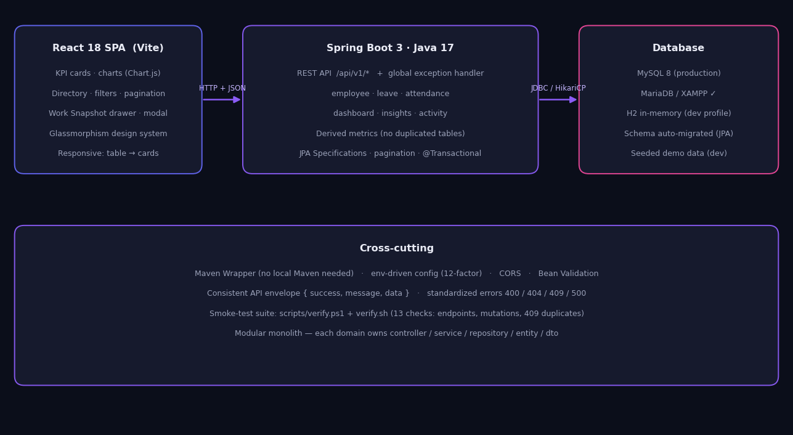

# PeopleOS — Smart Employee Management & Workforce Dashboard


A full-stack HR workforce platform: a glassmorphism-style React dashboard backed by a **Spring Boot 3 modular monolith** and **MySQL**. Search, filter and paginate employees, approve leave requests in real time, open a dynamically-generated "Work Snapshot" for any employee, and watch every KPI, chart and feed update reactively — no page reloads.



## Screenshots

| Dashboard | Employee Directory |
|---|---|
| *KPIs, attendance chart, department distribution* | *Search, filters, pagination, Work Snapshot drawer* |

> Run it in 2 minutes (below) and drop your own screenshots into `docs/screenshots/`.

## Feature highlights

- **Live dashboard** — total headcount, present/remote/on-leave today, open positions, department distribution, week/month attendance trends — all *derived from source records at request time* (no duplicated metrics tables)
- **Employee directory** — **card-first layout** (switchable to table) with unique avatars, status badges and department/location chips — cards spring-expand on hover (framer-motion) revealing animated Attendance / Leave-balance / Profile-completion bars with a staggered reveal and a text-swap action footer; multi-field search (debounced, with autocomplete), combinable filters (department, team, location, quick status chips), 6 sort orders, server-side pagination
- **Work Snapshot drawer** — one click opens a per-employee view: identity, 30-day attendance %, leave used/remaining, manager, recent activity. Generated on the fly from Employee + Attendance + Leave + Activity — no snapshot table
- **Leave management** — pending queue; Approve/Reject instantly removes the card, updates KPIs and appends to the activity feed (approved leave covering today flips the employee to ON_LEAVE)
- **Add Employee** — full client-side validation, duplicate email/code → friendly 409 handling, submit spinner, success toast, immediate list + KPI refresh
- **People Insights** — rule-based analytics generated from live data (remote-work patterns, attendance week-over-week, leave utilization)
- **Light & dark themes** — one-click toggle persisted in `localStorage` (no flash on reload); every surface re-themes through CSS custom properties and charts adapt their axes/grids
- **Date-wise attendance history** — inside the Work Snapshot drawer: per-day Present / Remote / Late / Absent records for the last week or month
- **Status quick-filters** — one-click chips (Active / Remote / On Leave / Inactive) on the directory to surface any group, e.g. all inactive employees
- **Project team assembly** — create a project with just a name and weightage (LOW / MEDIUM / HIGH); the backend assembles a complete team from employee experience: a Lead plus engineers (team size 3 / 5 / 7), with Product & Design included on MEDIUM and HIGH, and project roles (Lead / Senior / Engineer / Junior) auto-assigned from tenure. Members can be added or removed freely afterwards
- **Payroll** — per-employee monthly salary breakdown (basic, HRA, allowances, deductions → live net), editable in-app with an upsert API, paginated at 5/10/20 rows; net salary also surfaces inside each Work Snapshot
- **Upcoming Events** — a dashboard card beside Open Positions with the next holidays & celebrations (Vinayaka Chaturthi, Republic Day, Diwali…), computed from today's date with countdown chips
- **Unique avatars** — 100 deterministic locally-generated avatar images (no external services, no repeats) with graceful initials fallback
- **Open Positions management** — the dashboard KPI is derived live from a real positions module: add, edit and delete roles with title, department, location, status (Open / On Hold / Filled / Closed), openings count and posted date — every change updates the KPI and the activity feed instantly
- **Top-bar autocomplete** — debounced suggestions with avatar, role and department as you type; full keyboard navigation (↑ ↓ Enter Esc); clicking a result opens that employee's Work Snapshot instantly
- **Polished UX** — count-up KPI numbers, scroll-reveal motion, an SVG attendance ring in the Work Snapshot drawer, custom scrollbars, and full `prefers-reduced-motion` accessibility support
- **Resilient by design** — consistent API envelope, standardized 400/404/409/500 errors, empty/loading/error states everywhere, insights can never block the dashboard

## Tech stack

| Layer | Technology |
|---|---|
| Frontend | React 18, Vite, Chart.js, framer-motion (spring interactions), lucide-react, hand-built glassmorphism design system (CSS) |
| Backend | Java 17, Spring Boot 3.3, Spring Data JPA, Hibernate, Bean Validation, Maven |
| Databases | MySQL 8 / MariaDB (production) · H2 in-memory + seeded demo data (dev profile) |
| Tooling | Maven Wrapper, PowerShell + Bash smoke-test suites |

## Quick start — two ways to run

### Option 1 — Demo with mock data (no database needed) ⭐ recommended first run

The `dev` profile starts an **H2 in-memory database** pre-seeded with 100 employees across
7 departments and 9 teams, a pending-leave queue, payroll, positions, projects and 30 days
of attendance. Zero installation, fully populated dashboard in ~2 minutes.

**1. Backend** (leave this window running):

```powershell
cd backend
..\mvnw.cmd spring-boot:run "-Dspring-boot.run.profiles=dev"
# Linux/macOS:  ./mvnw spring-boot:run -Dspring-boot.run.profiles=dev
```

Wait for `Started PeopleOsApplication ...` — the seed runs automatically at startup.

**2. Frontend** (second terminal; first run only needs `npm install`):

```powershell
cd frontend
npm install      # first time only
npm run dev
```

**3. Open http://localhost:5173** — the dashboard loads fully populated.

> **Dependencies:** there is no `requirements.txt` — this is a Java + JavaScript stack.
> Backend dependencies live in `backend/pom.xml` (Maven, auto-handled by the included
> Maven Wrapper) and frontend dependencies in `frontend/package.json` (npm).

Data resets to the same seed on every backend restart (that is the only difference from
database mode). To stop: Ctrl+C in each window.

### Run the automated smoke test (~23 checks)

```powershell
powershell -ExecutionPolicy Bypass -File scripts/verify.ps1     # Windows
bash scripts/verify.sh                                          # Linux/macOS
```

### One command, full stack

```powershell
scripts\dev.ps1        # Windows: backend + frontend, waits for API health first
scripts/dev.sh         # Linux/macOS
```

### Docker (MySQL 8 + backend + frontend)

```bash
docker compose up --build      # app on http://localhost:5173
```

### Running with a database

The `dev` profile uses an **H2 in-memory database** — nothing to install, but data resets on
every restart. For data that persists, run against MySQL (or MariaDB) in one of two ways:

**Option A — Docker (recommended, nothing to install)**

```bash
docker compose up --build
```

This starts MySQL 8, waits for it to become healthy, then the backend and frontend.
App: http://localhost:5173 · API: http://localhost:8080

**Option B — Your own MySQL / MariaDB (e.g. XAMPP, MySQL 8)**

1. Create a database and a dedicated user (as root):

```sql
CREATE DATABASE IF NOT EXISTS peopleos;
CREATE USER IF NOT EXISTS 'peopleos'@'localhost' IDENTIFIED BY 'peopleos123';
GRANT ALL PRIVILEGES ON peopleos.* TO 'peopleos'@'localhost';
FLUSH PRIVILEGES;
```

2. Point the backend at it (PowerShell example; equivalents work on Linux/macOS):

```powershell
cd backend
$env:DATABASE_URL="jdbc:mysql://localhost:3306/peopleos?useSSL=false&allowPublicKeyRetrieval=true"
$env:DATABASE_USERNAME="peopleos"
$env:DATABASE_PASSWORD="peopleos123"
..\mvnw.cmd spring-boot:run        # NOTE: no 'dev' profile — this is production mode
```

3. Verify: `(Invoke-RestMethod http://localhost:8080/api/v1/health).data.status` → `UP`

Notes:
- The schema (`employees`, `attendance`, `leave_requests`, `payroll`, `positions`,
  `projects`, `activities`, …) is created automatically on first start.
- Production mode starts with an **empty database** by design — add employees through the
  UI, or run `scripts/verify.ps1`, which also seeds one test employee through the API.
- XAMPP's default is root with an **empty password** — set `$env:DATABASE_PASSWORD=""`
  and `$env:DATABASE_USERNAME="root"` instead. The environment variables must be set in the
  same terminal window that runs the backend.
- To switch back to the demo: just run with `-Dspring-boot.run.profiles=dev` again.

## API overview (all under `/api/v1`)

| Method | Endpoint | Description |
|---|---|---|
| GET | `/employees` | Paginated list — `search`, `department`, `status`, `location`, `page`, `size`, `sort` |
| GET | `/employees/{id}` | Single employee |
| GET | `/employees/{id}/snapshot` | Work Snapshot — derived from Employee + Attendance + Leave + Activity |
| POST | `/employees` | Create (duplicate email/code → 409) |
| PUT | `/employees/{id}` | Update |
| DELETE | `/employees/{id}` | Delete |
| GET | `/leaves/pending` | Pending leave requests |
| PUT | `/leaves/{id}/approve` · `/reject` | Approve / reject (updates work status + activity feed) |
| GET | `/attendance?range=week\|month` | Daily present/remote/late/absent counts |
| GET | `/dashboard` | KPIs + department distribution |
| GET | `/insights` | Rule-based People Insights |
| GET | `/activities` | Recent activity feed |
| GET | `/health` | Liveness + uptime |
| GET | `/employees/{id}/attendance?range=week\|month` | Date-wise attendance for one employee |
| GET | `/payroll` · GET/PUT `/employees/{id}/payroll` | Salary breakdown (upsert) |
| GET/POST/DELETE | `/projects` (+ `/{id}/members`) | Projects with auto-assembled teams |

All responses use a consistent envelope: `{ "success": true, "message": "...", "data": ... }`.

## Engineering notes

- **Modular monolith** — each domain (`employee`, `leave`, `attendance`, `dashboard`, `activity`) owns its controller / service / repository / entity / dto packages
- **Derived, never duplicated** — dashboard KPIs, snapshots and insights are computed from source tables on every request; changing an employee's status instantly reflects everywhere
- **Safe persistence layer** — JPA Specifications for dynamic filtering, `@Transactional` boundaries, `open-in-view: false`, unique constraints enforced at the schema level
- **12-factor config** — database URL, credentials and port are environment-driven (`application.yml` contains no secrets)
- **Ops-ready** — `GET /api/v1/health` for liveness/uptime, multi-stage Dockerfiles, `docker-compose.yml` with a healthy-MySQL dependency chain
- **Seeded demo dataset** — deterministic dev-profile seed (100 employees across 7 departments and 9 teams, a pending-leave queue, 30 days of attendance) so every reviewer sees the same populated dashboard

## Project Approach

### 1. AI Research & Usage — "AI as a Development Partner"

I used AI as a **development partner** while building the project. I mainly used it to research ideas, explore better UI approaches, improve the structure of the application, and help with debugging.

I used AI for:

* **UI/UX research** — exploring dashboard layouts, responsive design ideas and ways to make HR workflows simpler.
* **Development support** — getting suggestions for component structure, API design and implementation approaches.
* **Debugging** — using AI to understand errors and identify possible solutions during development.
* **Testing ideas** — checking different approaches and edge cases before deciding on the final implementation.
* **Documentation** — helping organize the project requirements and technical documentation.

I did not accept AI output blindly — **every change was verified by running the application and its automated smoke-test suite** (`scripts/verify.ps1`, ~23 checks) before being kept.

For the **People Insights** feature, I intentionally did not use an external AI/LLM. I used a **rule-based approach** because the required insights could be calculated directly from employee, attendance, leave and remote-work data. This keeps the feature faster, predictable and easier to maintain.

**My approach:** *Use AI to explore and improve ideas, but make the final decisions based on the actual project requirements.*

### 2. Logical Approach — "From HR Problems to Simple Actions"

I designed the dashboard around what an HR person actually needs to do: **find an employee, understand their current status, and take action quickly.**

Instead of spreading information across many pages, I connected **search, filters, employee details, Work Snapshot, attendance, leave management and quick team assembly** into one simple workflow.

The system follows a clear flow:

**HR User → Dashboard → Search/Filter → Understand Employee → Take Action → Updated Data**

For example, HR can search for the right employees, open their **Work Snapshot** to understand their attendance and leave status, and then use **Quick Team Assembly** to build a suitable project team.

The backend follows the same simple structure:

**React UI → REST API → Controller → Service → Repository → Database**

This keeps the user experience simple while keeping the business logic and data properly organized in the backend.

**My approach:** *Find → Understand → Decide → Act.*

### 3. Reason for Usage of Elements — "Every Element Has a Job"

I didn't add UI elements only to make the dashboard look attractive. Each element was added to solve a specific HR requirement.

* **Search + filters** → quickly find the right employee.
* **Work Snapshot** → understand an employee without opening multiple pages.
* **Status badges** → recognize employee status instantly.
* **Side drawer** → view employee details without leaving the employee list.
* **Attendance charts** → understand workforce patterns visually.
* **Leave management** → allow HR to handle pending requests directly from the dashboard.
* **Quick Team Assembly** → help HR create a suitable project team faster.
* **Glassmorphism** → give the dashboard a modern visual style while keeping sections clearly separated.
* **Toasts and loading states** → clearly communicate what is happening after an action.

My goal was to make every element useful rather than adding features just for the sake of adding them.

**My principle:** *If an element doesn't help the user, it doesn't need to be there.*

### 4. Unique Approach — "Understand People. Build Teams Faster."

My main unique approach has two parts:

#### Work Snapshot

Instead of showing only basic employee details, I created a quick **360° view** combining:

**Employee Details + Work Status + Attendance + Leave + Recent Activity**

This helps HR understand an employee's current situation without opening multiple pages.

#### Quick Team Assembly

I also added a **Quick Team Assembly** feature that helps create a project team based on employee work status, experience and role.

The system can quickly suggest a suitable team, and HR can then manually add or remove members if needed.

Together, these features make the dashboard more than an employee-management system. It helps HR **understand the right people and quickly bring the right people together for a project.**

**My idea:** *Understand people faster → assemble teams faster → make better decisions.*

## Project structure

```
peopleos/
├── backend/   Spring Boot API — modular monolith (employee, leave, attendance, dashboard, activity, position, payroll, project)
├── frontend/  React + Vite SPA — glassmorphism design system, responsive to mobile
├── scripts/   verify.ps1 (Windows) · verify.sh (Linux/macOS) smoke-test suites
└── docs/      architecture diagram
```

## License

MIT — see [LICENSE](LICENSE).
